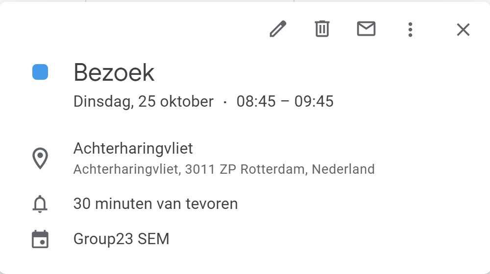
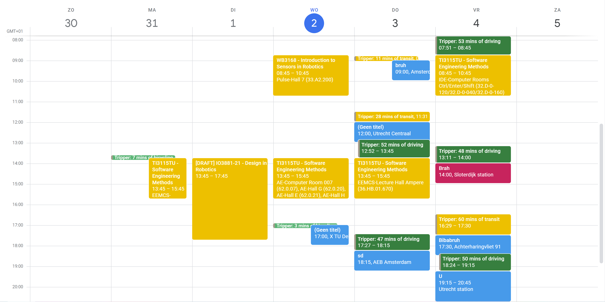
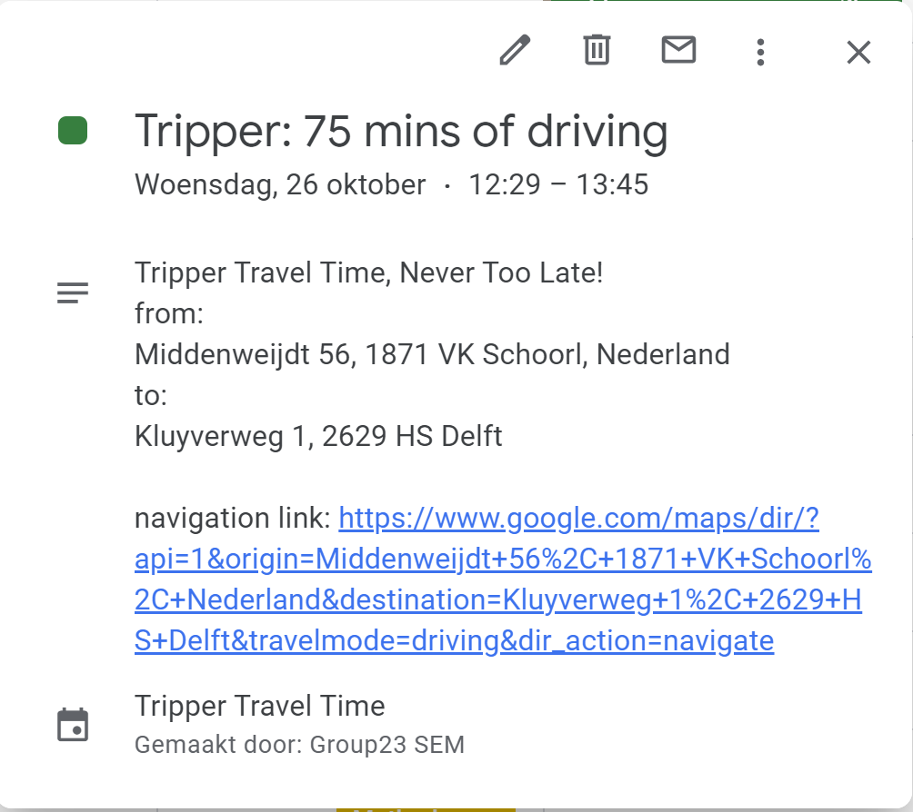

<a name="readme-top"></a>

<h1 align="center">Tripper: Always on Time!</h1>

  <p align="center">
    This project was created to alleviate users of a daily routinal task that often recurs more than once every day. Tripper can be used to add a travel planning to each appointment in the users Google Agenda. It will block the time to get to an appointment, with the travel time being based on the prefered travel method, it can send departure reminders, share a link to your itinerary in Google Maps and it also updates if appointments are changed.
    </br>
    <a href="https://gitlab.ewi.tudelft.nl/-/ide/project/ti3115tu/2022-2023/Group-23/issues">Report Bug</a>
    ·
    <a href="https://gitlab.ewi.tudelft.nl/-/ide/project/ti3115tu/2022-2023/Group-23/issues">Request Feature</a>
  </p>
</div>


<!-- TABLE OF CONTENTS -->
<details>
  <summary>Table of Contents</summary>
  <ol>
    <li>
      <a href="#getting-started">Getting Started</a>
      <ul>
        <li><a href="#prerequisites">Prerequisites</a></li>
        <li><a href="#installation">Installation</a></li>
      </ul>
    </li>
    <li><a href="#usage">Usage</a></li>
    <li><a href="#roadmap">Roadmap</a></li>
    <li><a href="#license">License</a></li>
  </ol>
</details>


<!-- GETTING STARTED -->
## Getting Started

To get a local copy up and running follow these simple example steps.

### Prerequisites

* Python >3.10
* Telegram
* Google Calendar


### Installation

1. Message us to add your Google account to authorized accounts or use the throwaway account provided.
   ```sh
   Throwaway with example calendar
   user: group23sem@gmail.com
   pass: DikkeTripper
   ```
2. Clone the repo
   ```sh
   git clone https://gitlab.ewi.tudelft.nl/ti3115tu/2022-2023/Group-23.git
   ```
3. Install pip requirements in a virtual environment (if you don't want to run in a venv, adjust the path around line 24 in \_\_main.py__.)
   ```sh
   pip install -r requirements.txt
   ```
4. Adjust PowerShell ExecutionPolicy
   ```sh
   Set-ExecutionPolicy RemoteSigned
   ```
5. Add a '[Tripper]' label in the title or description in Google Calendar for each calendar you want to have Trippered.

6. Run the project or '\_\_main__.py' using the virtual environment 

<h3 align="center">Server installation</h3>

We also provide you with a server branch, which is specifically designed for a server! This enables the developer to easily deploy Tripper on a server, but unfortunately only one client can be served at a time as of now.
To install the server branch:
1. Follow until step 3 from the instructions above. 
2. Add the path to SSL certificates and server domain to webhook_listener.py
3. Add user to users.json
4. Start webhook_listener.py and select the user
5. Authenticate user!

<p align="right">(<a href="#readme-top">back to top</a>)</p>


<!-- USAGE EXAMPLES -->
## Usage

In the Calendar there need to be events with its dedicated location added to it, as it is shown in the example underneath. With this added to its events, a calendar can look like the other example that is shown beneath. 2 events in one day makes it so you travel from one event location to the other location. The resulting event that is added to the calender looks something like te last example.
<p align="left">
  
<p align="right">
  
</p>
<p align="right">
  
</p>

<p align="right">(<a href="#readme-top">back to top</a>)</p>


<!-- ROADMAP -->
## Roadmap

- [x] UI using telegram
    - [x] Setting a home location for a user
- [x] Travel time calculated using maps
    - [x] Getting the preferred traveling method
- [x] Making a calender event of the travel time right before event
    - [x] Adding the maps link to it
- [x] Multi users
    - [ ] Multiple users at the same time

See the [open issues](https://gitlab.ewi.tudelft.nl/ti3115tu/2022-2023/Group-23/issues) for a full list of proposed features (and known issues).

<p align="right">(<a href="#readme-top">back to top</a>)</p>


<!-- LICENSE -->
## License

Distributed under the MIT License. See `LICENSE.txt` for more information.

<p align="right">(<a href="#readme-top">back to top</a>)</p>
